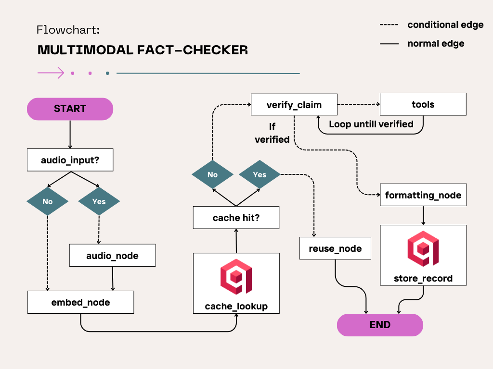

# Fact-Check AI Bot 🔍

An intelligent, multi-modal fact-checking assistant powered by **LangGraph**, **GPT-4o-mini**, and **Qdrant**. This bot verifies claims by orchestrating real-time Google searches, Wikipedia retrieval, and a high-performance vector cache to minimize costs and maximize speed.

## ✨ Features

- **Multi-Modal Input:** Verify claims via text or audio files (transcribed via Whisper).
- **Semantic Cache:** Uses **Qdrant** to store and retrieve past fact-checks, allowing the bot to "remember" previous verifications.
- **Agentic Workflow:** Built with LangGraph to handle complex decision-making, tool calling, and iterative verification.
- **Structured Output:** Delivers a consistent **Verdict**, **Confidence Score**, and **Evidence** summary using Pydantic.

---

## 🛠️ Setup Instructions

### 1. Prerequisites

- Python 3.10+
- A [Qdrant](https://qdrant.tech/) Cluster (Cloud or Local)
- API Keys for: OpenAI, Serper.dev, and Qdrant.

### 2. Installation

Clone the repository and set up a virtual environment:

```bash
git clone [https://github.com/your-username/fact-check-bot.git](https://github.com/your-username/fact-check-bot.git)
cd fact-check-bot

# Create and activate virtual environment
python -m venv venv
source venv/bin/activate  # On Windows: venv\Scripts\activate

# Install dependencies
pip install -r requirements.txt
```

### 3. Environment Configuration

Create a .env file in the root directory:

```txt
OPENAI_API_KEY=your_openai_key
SERPER_API_KEY=your_serper_google_search_key
QDRANT_API_KEY=your_qdrant_api_key
QDRANT_CLUSTER_ENDPOINT=your_qdrant_url
```

## 🚀 Usage

**Mode A: Ingest Knowledge Base**

Prime the vector database with reliable information from Wikipedia before checking claims.

```bash
# Ingest specific topics from the CLI
python main.py --mode ingest --topics "World War II" "Albert Einstein" "Climate Change"
```

**Mode B: Fact-Checking (Chat)**

Verify a claim using the agentic workflow.

**Text Input:**

```bash
python main.py --mode chat --claim "India won the T20 World Cup in 2024"
```

**Audio Input:**

```bash
python main.py --audio "path/to/recording.m4a"
```

## Flowchart


